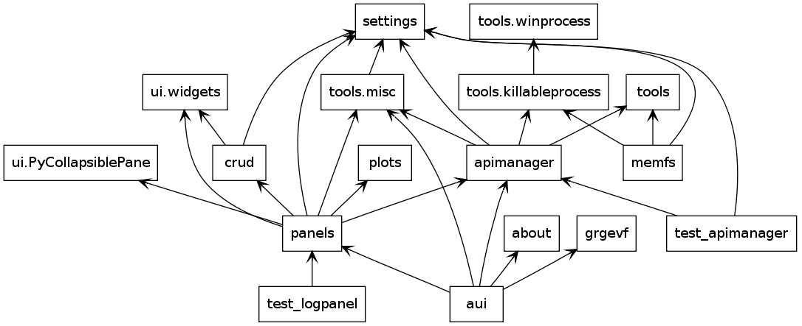

.. _arquitectura:

Arquitectura
************* 

En este capitulo se describe, de manera conceptual, el diseño arquitectónico
de la aplicación. La metodología ágil e iterativa adoptada no implica 
que no haya existido una instancia de reflexión en el diseño en la aplicación, 
sólo que esta no es estado basada íntegramente en una descripción formal y exhaustiva 
como UML. 

Según afirma Terry Quatrani, evangelizadora de las metodologías ágiles en IBM, 
en [Quatrani2010]_ :

    Aunque sigas un proceso ágil, estarás realizando cierto grado de modelado
    – sólo que no lo realizarás tanto como si utilizaras un proceso tradicional. 
    La falta de formalidad en el modelado ágil no significa que no estás modelando, 
    sino que te pones el foco en los beneficios de este sin las desventajas 
    y confusiones de documentos extraños y burocráticos. 

Por su parte, Robert Martin afirma en [Martin2006]_ que el modelado 
en el desarrollo ágil es útil como instrumento de comunicación, 
pero no aporta información ahondar en detalles: 

    No gastes mucho tiempo en esta tarea... no necesitas tanto detalle. 
    Los modelos y los planos son necesarios en la arquitectura y la construcción
    civil porque es caro construir una casa para demostrar que su diseño funciona 
    o no. El software no es así – puedes validar tu diseño con sólo codificarlo 
    al momento de realizar un diagrama. 

.. _modelo:

Modelo conceptual
=================

La siguiente infografía describe conceptualmente, de manera simplificada, 
el flujo de procesamiento de la información.

.. figure:: images/workflow.png
   :width: 70%

   :index:`Diagrama conceptual` del flujo de información entre las distintas capas 

El frontend, objeto de este trabajo, se compone de la interfaz de usuario, 
la gestión de base de datos, los algoritmos de procesamiento de 
la información y la graficación.

:abbr:`API (Application Programming Interface)` refiere a la interfaz de 
comunicación definida para la comunicación entre ambas partes, que está basada
en archivos de texto plano con un formato particular. El relevamiento de esta interfaz 
formó parte del desarrollo, y se describe exhaustivamente en :ref:`api`. 
Una librería modularmente independiente, basada en ese relevamiento se 
programó para dar soporte a la comunicación. Se describe en :ref:`backend`. 

El backend refiere al conjunto de programas desarrollados en Fortran que implementan
los algoritmos de cálculo. Estos programas leen uno o varios archivos de entrada
y producen un archivo de salida con los vectores de números 
reales resultantes de los cálculos (la información a graficar) junto a otras 
informaciones relativas al contexto de cálculo

Los algoritmos de procesamiento del frontend analizan y extraen sólo la información útil, 
haciendo una conversión de texto a un tipo de dato numérico y con esa información
se realizan los gráficos correspondientes. 

Componentes y capas de software 
================================

El siguiente diagrama, diseñado con la intención de favorecer la comprensión
por sobre el apego a la especificación :term:`UML`, describe las capas y 
:index:`componentes` de software involucrados en la aplicación. 

.. figure:: images/arquitectura.png
   :width: 60%

   Arquitectura Frontend - Middleware - Backend      

Este diagrama brinda más detalles sobre la 
vinculación de los componentes y las capas de software. Por simplicidad, 
se ha obviado la descripción de los componentes Matplotlib y Numpy, asumiéndolos 
tácitamente como parte de la aplicación. 

Los componentes de :term:`middleware` de conexión a la base de datos 
:py:mod:`sqlite3` (un :term:`wrapper` sobre ``Sqlite``) y el módulo que permite 
la ejecución de procesos hijos 
(o "subprocesos") :py:mod:`subproccess`` forman parte de las versiones 
2.5 y 2.4 de Python respectivamente. Es decir, no son componentes de software 
que se requieran por separado. 

La llamada a los procesos del backend a través de :py:mod:`subproccess`` está 
intercedida por el emulador *Wine* en todas las plataformas diferentes 
a Windows. Esto se describe ampliamente en :ref:`wine`.

Un componente que se representa intrínsecamente vinculado al frontend es 
Pub/Sub. La explicación de la importancia estructural de este componente
se describe en :ref:`uso-pubsub`.

Diagrama de despliegue
======================

El diagrama de despliegue de la figura :ref:`despliegue-num`, es una representación  
más formal (basada en la especificación UML) de los anteriores diagramas.

.. _despliegue-num:

.. figure:: images/arquitectura.png
   :width: 60%

.. _bbdd_design:

Capa de base de datos
=====================

La aplicación no requiere una infraestructura de base de datos compleja. 
En particular, los datos almacenados son las constantes de compuestos 
químicos. 

Se incluye una vasta base de datos termodinámicos para más de 2000 compuestos, 
corroborados mediante `DIPPR Project 801 <http://dippr.byu.edu/>` [#]_ que incluye información 
como la fórmula, el factor acéntrico, el volumen, la temperatura y la presión crítica, 
etc. 

Esta información se comporta en modo *sólo lectura* [#]_ 
a través de la interfaz de usuario, pero se brinda también una categoría editable 
para permitir *compuestos definidos por el usuario* que pueden ser agregados como 
una copia de un compuesto existente en :abbr:`DIPPR` (que acepta, entonces, la modificación 
o ajuste de sus valores) o bien como un nuevo compuesto definido desde datos 
experimentales. 

Modelo Entidad-Relación
-----------------------

El modelo Entidad-Relación es un diagrama que describe la interrelación de 
la información gestionada por la base de datos. Se muestra en la figura :ref:`bd-num`. 

.. _bd-num:

.. figure:: images/er-database.png
   :width: 90% 

   Representación de las entidades con sus atributos y la 
   relación entre las mismas

.. seealso::
    
   Vea :ref:`bbdd` para la implementación. 

Diagrama de paquetes
====================

El diagrama de paquetes de la figura :ref:`diag-pack-num`,  que forma parte de la suite definida por UML 2.0, muestra los paquetes y módulos (unidades de código fuente) y su árbol interdependencia. 

.. _diag-pack-num:

   Diagrama de paquetes 
   
Este diagrama se realizó mediante un análisis de ingeniería inversa utilizando 
la herramienta `pyreverse <http://www.logilab.org/blogentry/6883>`_

Diagramas de clases
===================

Se incluyen en las siguientes figuras diagramas de clase de la 
aplicación. 

Se insiste en que en el proceso de desarrollo no existió una especificación 
de esta magnitud de detalle previa a la implementación, pero se ofrecen 
al lector, generadas mediante el análisis del código, como orientación 
sobre la estructura arquitectónica de la aplicación.

Relación y dependencia de los paneles
-------------------------------------

El diagrama de la figura :ref:`class2-num` muestra la relación y jerarquía de las 
clases que componen la interfaz de usuario.

.. _class2-num:

.. figure:: images/classes1.png
   :width: 90% 

   Jerarquía de clases de la GUI
 
La clase `ShellPanel` corresponde a una consola interactiva que se incluyó 
en uno de los prototipos presentados, pero luego ha sido descartada en versiones
actuales por no formar parte de los requerimientos especificados. 

Relaciones del Panel de caso  
-----------------------------

El diagrama de clases de la figura :ref:`class1-num` hace hincapié en la 
clase `CasePanel` y sus relaciones de composición

.. _class1-num:

.. figure:: images/classes1.png
   :width: 80% 

   `CasePanel` y su composición

Clases vinculadas a la graficación
----------------------------------

El diagrama de la figura :ref:`class3-num` describe las clases 
relacionadas con la graficación. Muchas de estas forman parte de MatploLib.
   
.. _class3-num:

.. figure:: images/classes3.png
   :width: 90% 

   Diagrama de clases relacionadas con la graficación 

.. _tipos-graf:

Tipos de gráficos 
-----------------

Los tipos de gráficos 2D y 3D tiene un diseño jerarquico de clases como se 
muestra en la figura :ref:`plotclass-num`, donde las subclases reimplementan 
el método que selecciona el subconjunto de datos
que cada gráfico necesita. Los métodos comunes son heredados de la superclase. 

.. _plotclass-num:

.. figure:: images/class-plots.png
   :width: 65%

   Diagrama de clases de los distintos tipos de diagramas soportados 

.. _preceptos-ui:

Preceptos adoptados en el diseño de UI
======================================

Como se ha mencionado, la usabilidad e intuitividad de la interfaz de usuario
ha sido un requerimiento de especial atención. Mucha bibliografía fue consultada
al respecto, rescantando en particular muchos conceptos y consejos de Joel Spolsky 
en [Spolsky2001]_ [#]_ . Entre muchos, se destacan:

    - Brindar contextos intuitivos y secuencias de operación lógicas.
    - Minimizar las opciones en simultáneo. Cada opción es una decisión que se le 
      exige al usuario.  
    - Los usuarios no leen manuales (de hecho tampoco leen mensajes en pantalla si son largos)
    - Convenciones por sobre configuraciones: limitar los parámetros requeridos
    - Valerse de las costumbres del usuario: no reinventar la rueda

Un software complejo con un acabado estudio de usabilidad es 
`Mayavi <http://code.enthought.com/projects/mayavi/>`_ , que ha servido de inspiración
para el diseño de GPEC. 

.. figure:: images/mayavi2.png
   :width: 90%

   Interfaz de la aplicación de visualización de diagramas VTK que sirvió 
   como inspiración para la interfaz de GPEC.  

Algunas decisiones concernientes a la usabilidad han sido:

* El diseño acompaña al *workflow*: primero se define el sistema, opcionalmente 
  se manipulan los cálculos y por último se grafica. Sólo el primero y el último
  paso son obligatorios. 

* La ubicación de los botones principales está dispuesta en función del 
  flujo de lectura de occidental (de izquierda a derecha y de arriba hacia abajo)
  de manera de resultar intuitiva la secuencia de acciones demandada al usuario  

* Todos los botones tiene asociado un ícono descriptivo

* Los componentes que muestran información no modificable se mantienen en modo
  sólo lectura y visualmente se ven "grisados". 

* Un conjunto de parámetros (coeficientes, reglas de combinación) se ubican en 
  un panel colapsable. Al expandirlo, el panel genera automática una barra de 
  desplazamiento vertical. 

* El uso del símbolo "+" en la ubicación dispuesta es una convención popularizada 
  por los navegadores web para abrir una nueva pestaña de trabajo. Dado el contexto
  resulta evidente que genera un nuevo caso. 

.. figure:: images/usabilidad_labels.png
   :width: 100%

   Interfaz de la aplicación de visualización de diagramas VTK que sirvió 
   como inspiración para la interfaz de GPEC.  

.. [#]  *DIPPR 801* es un producto comercial cuya licencia ronda los u$s3400 anuales. 
        GPEC incluye en su base datos equivalentes a una porción de la información
        que ese producto ofrece, sin depender de esta de manera alguna. 
        No obstante, el autor considera este aspecto como suceptible a acarrear 
        complicaciones legales y comerciales, que deberán revisarse y solucioanrse 
        a futuro.

.. [#]  Sqlite no permite definir tablas o registros de datos como *sólo lectura*. 
        Queda en potestad del desarrollador vedar la posilidad de modificación como parte    
        del proceso de validación. Sin embargo, siempre es posible para un usuario abrir
        y modificar la información "manualmente" a través de un gestor que interprete 
        el formato *sqlite*. 
        

.. [#]  Una versión online gratuita de este libro se encuentra en 
        http://www.joelonsoftware.com/uibook/fog0000000249.html

.. [Quatrani2010]  Quatrani, Terry (2010) *The Truth About Agile   
                   Modeling*. Cita extraída de 
                   http://agilescout.com/agile-modeling-and-uml/

.. [Martin2006]  Martin, Robert (2006) *Agile Principles, Patterns, and Practices in C#*, 
                 Prentice Hall. Cita extraída de http://stackoverflow.com/questions/61487/do-you-use-uml-in-agile-development-practices
                 
