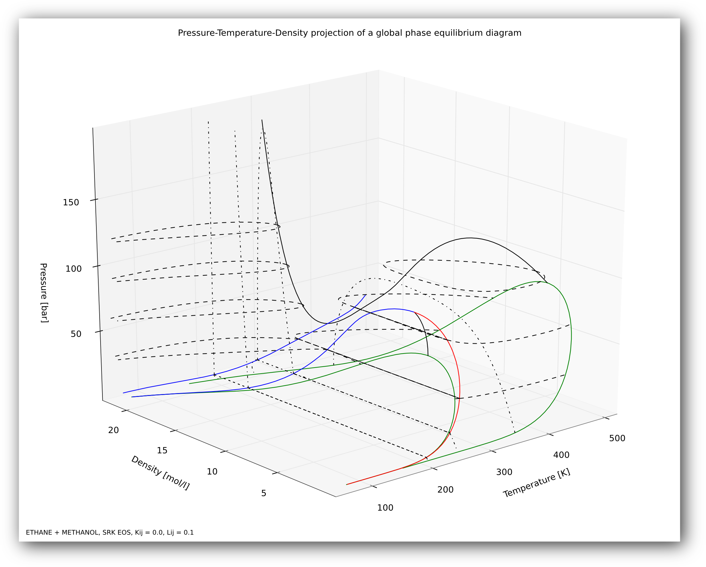
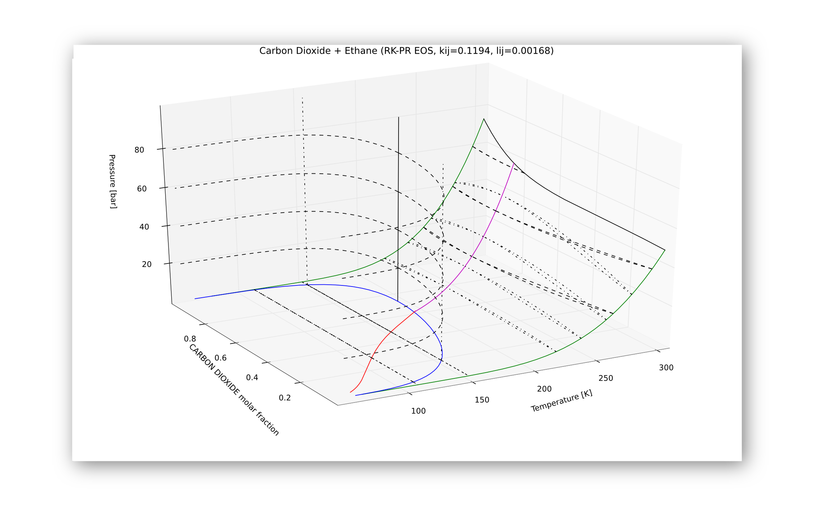

.. _ejemplos:

Ejemplos de diagramas
*********************

Este apéndice muestra algunos ejemplos de diagramas realizados con la aplicación

   Visualización 3-D de un diagrama global P-T-ρ con superposición de curvas Pxy y Txy.  
   Los gráficos 3D se pueden rotar a la perspectiva deseada. 

.. figure:: images/ej2.png
   :width: 90%

   Visualización 3-D de un diagrama global P-T-z (comportamiento tipo I) y superposición de diagramas tipo Pxy para distintas temperaturas, Txy para distintas presiones e isopletas para distintas composiciones.

.. figure:: images/ej5.png
   :width: 90%

   Superposición de tres diagramas globales que permiten observar el efecto del parámetro de interacción k12. La imágen fue exportada desde GPEC.   

   Visualización 3-D de un diagrama  global P-T-z con superposición de curvas 
   Pxy, Txy e isopletas.

