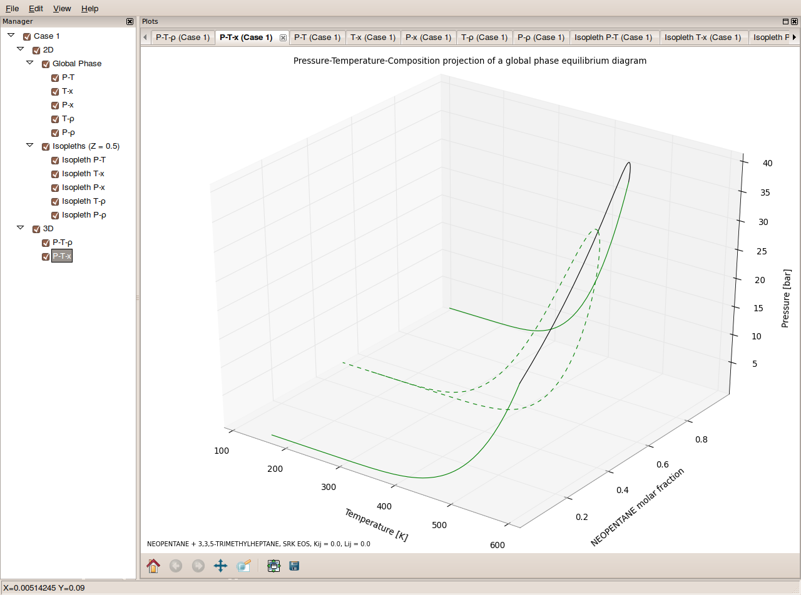
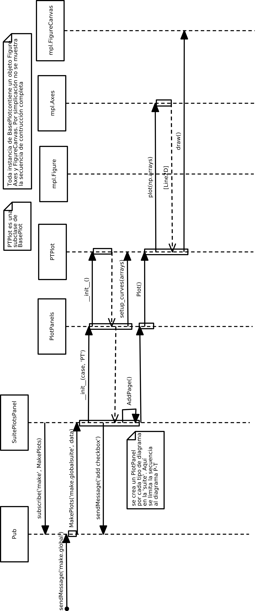
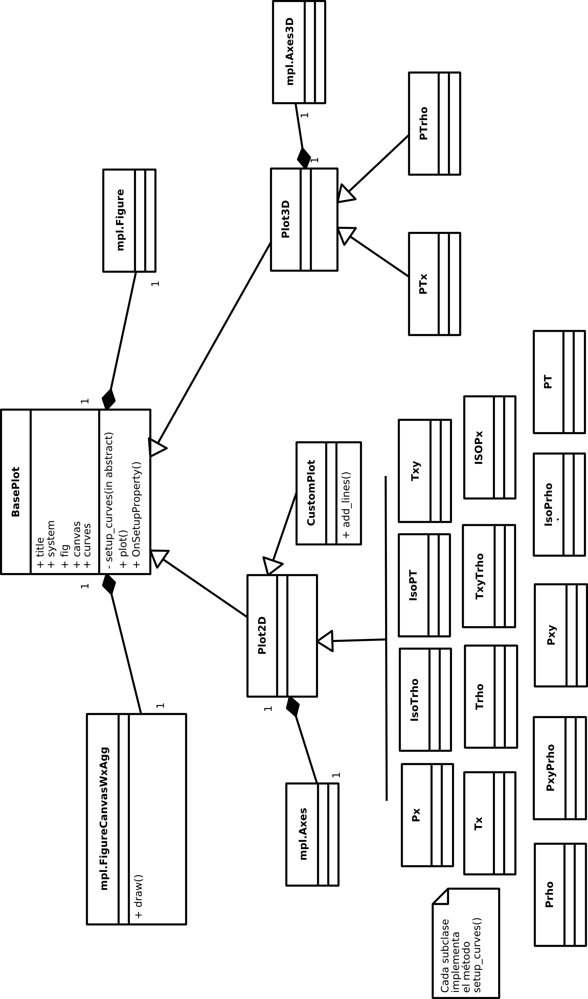
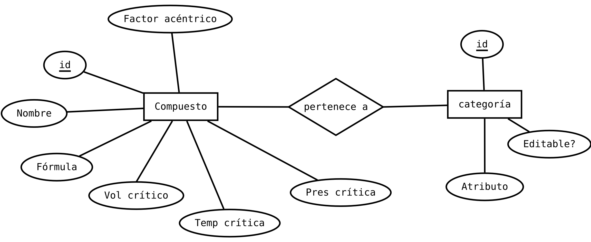

.. _implementacion:

Implementación
***************

.. _uso-pubsub:
        
Utilización de Publish/Suscribe en GPEC
========================================

En :ref:`pubsub` (ver :ref:`marco`) se describió el patrón PubSub y la implementación 
utilizada para diferentes aspectos del funcionamiento de GPEC. Aquí se describen 
más en detalles estos usos.

Panel de mensajes
-----------------

Como se ha dicho, PubSub constituye el patrón principal y toda la *orientación
a eventos* de la biblioteca se basa en una comunicación vía esta biblioteca. 

El ejemplo canónico es el **panel de log** (registro de mensajes de usuario), donde
se registra una crónica de eventos de interés para el usuario, denotados en 
su categoría con un símbolo y la hora del suceso. 

.. figure:: images/log_msg.png
   :width: 80%

   A través de PubSub, cualquier parte del programa envía avisos que el panel
   (un *receptor*) mostrará al usuario. 

En la incialización del panel se realiza la subscripción a los mensajes con 
tópico ``'log'``, y asigna como acción el método ``OnAppendLog()``::

    class LogMessagesPanel(wx.Panel):
        def __init__(self, parent, id):
            wx.Panel.__init__(self, parent, id)

            self.list = wx.ListCtrl(self, -1,  style=  wx.LC_REPORT|wx.SUNKEN_BORDER)
            self.setupList()

            sizer = wx.BoxSizer()
            sizer.Add(self.list, 1, wx.EXPAND)
            self.SetSizerAndFit(sizer)
        
            pub.subscribe(self.OnAppendLog, 'log')

Ante la recepción de un mensaje se produce la invocación del método
adjuntando como parámetro un *objeto mensaje* (``msg``) en cuyo atributo ``data``
se almacena la información enviada por el remitente::

    def OnAppendLog(self, msg):
        ico = self.icon_map[msg.data[0]]

        message = msg.data[1]
        index = self.list.InsertImageStringItem(sys.maxint, message, ico)
        self.list.SetStringItem(index, 1, time.strftime('%H:%M:%S'))
        self.list.EnsureVisible(index) #keep scroll at bottom

        if msg.data[0] == 'error':
            wx.Bell()

La información en ``msg.data`` es, por convención de diseño, una tupla
de la forma ``(asunto, mensaje de usuario)``. Los asuntos posibles están asociados 
al icono que los representan: 

    =============  ============= =========================
     Asunto         Símbolo       Descripción  
    =============  ============= =========================
      *ok*          |ok|          Acción existosa               
      *info*        |info|        Información importante
      *warning*     |warning|     Advertencia  
      *error*       |error|       Error
    =============  ============= =========================

.. |ok| image:: images/ok.png
.. |info| image:: images/info.png
.. |warning| image:: images/warning.png
.. |error| image:: images/error.png

Como se observa en el código, en caso de un mensaje del tipo "error", además
de agregar el mensaje se ejecuta ``wx.Bell()`` que produce una alerta sonora. 

El *remitente* de mensajes de log se realiza desde múltiples puntos. Por ejemplo
ante la carga de la aplicación, cuando se define un sistema, cuando se realiza
un cálculo (mediante la invocación a un ejecutable del *backend*), etc. 
Por ejemplo, en el código de ejecución de la aplicación, en ``aui.py`` se 
observa::

    (...)
    main_frame.Show()
    pub.sendMessage('log', ('ok', 'GPEC is ready. Define a system to begin') )
    app.MainLoop()

Solicitud de gráficación
-------------------------

Otro uso de ``PubSub`` se produce durante la solicitud de 
de generación gráficos. Se resume en el diagrama de secuencia de la figura 
:ref:`makeplot-num`. 

.. _makeplot-num:

.. figure:: images/uml_sec_makeplot_vertical.png
   :width: 60%
   
   Secuencia para la generación de un diagrama desde el evento generado por 
   el usuario 

Esto significa que el panel de definición de casos está independizado del 
panel contenedor de los gráficos generados a traves de PubSub. 
El mencanismo invocación del backend (desde donde se obtienen los datos a graficar) 
se verá más adelante. 

El objeto :py:class:`SuitePlotsPanel` es el panel de pestañas donde se muestran 
los gráficos de todos los casos de un proyecto. Cada una de estas pestañas 
contiene un objeto :py:class:`PlotPanel` que es el que soporta 
la integración con Matplotlib y contiene el diagrama en sí. 
Esta integración se verá en :ref:`matplotlibwx` .

Exposición de archivos de datos
-------------------------------

Cada invocación a un ejecutable del backend dependen de una entrada 
y produce una salida [#]_ en un archivo de texto. Para usuarios avanzados que conocen 
la estructura y significado de estos archivos (descriptos en :ref:'api'), es 
deseable que tengan un acceso al contenido desde la propia aplicación, para 
encontrar información numérica cuya precisión se pierde en un gráfico. 

.. figure:: images/inpout.png
   :width: 100%

   Panel de navegación y visualización de archivos en entrada y salida 

Esta tarea se hace a través de PubSub. El emisor envía un mensaje con tópico
``add_txt`` adjuntando como información una tupla con la ruta al archivo 
y el caso al que este cálculo pertenence. 

Por ejemplo, la función que escribe el archivo de entrada para el cálculo de 
parámetros es la siguiente:

.. literalinclude:: ../src/apimanager.py
   :pyobject: ApiManager.write_conparin

El atributo :py:attr:`path_temp` está definido en el constructor de la clase 
:py:class:`API` y se trata de una ruta a un subdirectorio en la carpeta temporal, 
abstraída del sistema operativo subyacente mediante el módulo :py:mod:`tempfile`

El receptor de este mensaje es :py:class:`IOPanel` que maneja el mensaje con el 
método :py:meth:`OnAddItem` .

.. literalinclude:: ../src/panels.py
   :pyobject: IOPanel.OnAddItem

Tabla de incidencias de mensajes
--------------------------------

Se lista aquí una tabla con diferentes tipos de mensajes, su utilidad, emisor/es 
y destinatario/s:

  ==============  ======================  ========================= =================== 
   Tópico           Descripción             Emisor/es                 Receptor/es    
  ==============  ======================  ========================= ===================
   log              Mensaje al usuario      varios                    LogMessagesPanel
   add_txt          Expone archivo de       ApiManager.*              IOPanel
                    backend
   clone case       Crear un nuevo caso     CasePanel.Clone           TabbedCases
                    a partir del actual
   make.*           Invoca el cálculo y     CasePanel.OnMakePlots     SuitePlotsPanel
                    genera el gráfico
   refresh all      Refresca la interfaz    varios                    MainFrame
                    de usuario
   active page      Trae a primer           PlotsTreePanel            SuitePlotsPanel
                    plano una pestaña 
                    de los gráficos
  ==============  ======================  ========================= ===================

Para un listado completo puede analizar el código fuente ejecutando 
``grep -r "pub.sendMessage"`` sobre el directorio de código fuente raiz
de GPEC. [#]_ 

.. _backend:

Invocación de ejecutables del backend
=====================================

La comunicación frontend-backend se describe en el diagrama de secuencia 
de la figura :ref:`front-back-num`. Allí se resalta el ciclo de vida del objeto :py:class:`ApiManager` donde está  implementada la lógica de tratamiento de la interfaz de comunicación. 

El caso particular representado es la obtención de datos el cálculo del diagrama
de fase global (que se obtiene mediante el ejecutable :program:`GPEC.exe`) 
satisfaciendo las precondiciones de ejecución (por ejemplo, que exista el archivo 
de entrada :file:`GPECIN.DAT`, que exista permiso de ejecución, que exista
permiso de escritura en la carpeta destino). En caso de error por algún motivo
(conocido o no), se remite un mensaje de log y se cancela la ejecución. 

.. _front-back-num:

.. figure:: images/uml_front-back_vertical.png
   :width: 100%

   Secuencia de la comunicación frontend-backend

.. _wine:

La dependencia con Wine
------------------------

El *backend* de GPEC, codificado en Fortran por Cismondi, ha sido compilado mediante 
Microsoft Fortran y se compone de un conjunto de ejecutables Windows (``.exe``). 
Si bien el código es Fortran estándar y compatible con compiladores libres (como 
`GNU Fortran <http://gcc.gnu.org/fortran/>`_ ) pudiéndose generar ejecutables 
específicos para sistemas Linux, existe una dependencia con la librería 
propietaria  *IMSL® Numerical Libraries*, que brinda un conjunto de rutinas 
matemáticas (álgebra lineal, cálculo matricial, etc.) que se utilizan en la 
implementación de los algoritmos.  

Esta dependencia impide, por el momento, generar una versión completamente 
nativa para plataformas Linux (y, a priori, la posibilidad de liberar 
completamente el código). 

Para permitir la ejecución sobre Windows es necesario la utilización de 
*Wine*, un software que ofrece una capa de compatibilidad para aplicaciones  
DOS, Windows 3.x, y win32, proveyendo una implementación alternativa (y parcial) 
del núcleo NT. 

A través de Wine, los ejecutables Fortran de GPEC funcionan perfectamente. 
La función que invoca estos ejecutables verifica el sistema operativo en que 
se está corriendo la aplicación y en caso de no ser Windows, invoca a Wine::

       args = []
       if sys.platform != 'win32':
           #On any non-Windows system, we run binaries through wine
           args.append('wine')
        
       args.append( os.path.join(PATH_BIN, bin + '.exe'))

.. note::
   
   Esta dependencia es salvable utilizando la versión para Linux de la biblioteca
   *IMSL* pero que únicamente es compilable mediante `Intel® Fortran Composer 
   <http://software.intel.com/en-us/articles/intel-composer-xe/>`_ , con lo cual 
   se duplica la dependencia de software privativo.  

Memorización de resultados costosos
====================================

Como se observa la figura :ref:`front-back-num`, el proceso de comunicación y obtención de los 
datos desde el backend no es trivial. Más aún, considerando que, dada la arquitectura
heredada interviene de manera insalvable la escritura y lectura a disco, el 
proceso también es costoso [#]_ a nivel computacional. 

Tomando de ventaja de la condición determinística de la operación (para los mismos 
parámetros de entrada, es decir el caso, se obtiene siempre el mismo resultado) 
se puede calcular una vez, guardar el resultado en memoria, y devolverlo sin 
recalcular cada vez que la operación con exáctamente los mismos parámetros 
es solicitada de nuevo. A este proceso se lo denomina :dfn:`caché de datos`. 

Esto tiene validez, además, dado que la probabilidad de que los parámetros
sean los mismos es alta. Por ejemplo, en el siguiente caso de uso:

    El usuario necesita generar una isopleta para determinada composición
    (o cualquier otra curva no global). Para esto, GPEC requiere haber
    calculado el diagrama global previamente (los ejecutables requieren :file:`GPECOUT.DAT`
    como precondición de entrada), de modo que este cálculo se realiza
    sin mostrar los diagramas. 
    Si posteriormente el usuario decide que necesita los diagramas globales, 
    simplemente se grafican el respaldo en memoria sin realizar la el cálculo
    mediante backend. 

Por último, dado el manejo referencial de memoria que hace Python, la permanencia 
del array en memoria no está duplicada respecto al que se utiliza para graficar.

Patrón *decorator* 
-------------------

Una forma habitual de implementar el mecanismo de 
*caché* es a través del patrón  :term:`Decorator`, que en términos
simplificados realiza una transformación dinámica de una función o método, 
agregándole una funcionalidad que no tiene por sí misma, o más en general, 
alterando de alguna manera el resultado devuelto. 

.. figure:: images/Decorator_UML_class_diagram.png
   :width: 60% 

   Diagrama de clases del patrón *Decorator*

Expresándolo en términos matemáticos, se trata de una :dfn:`composición de funciones`:

.. math::

   X \to \,\,Y\;\; \to \;\;\,Z

   x \mapsto f(x) \mapsto g(f(x))

Desde la versión 2.4, Python tiene una nomenclatura facilitada para la 
escritura de decoradores. Una estructura genérica para la definición 
de una función decoradora, que se compone de un :term:`wrapper`
de dos funciones anidadas [#]_,  es la siguiente::
 

     def mydecorator(function):
         def _mydecorator(*args, **kw):
             # hacer las tareas de 'decoración' 
             # antes de llamar a la funcion decorada 
             res = function(*args, **kw)
             # hacer otras cosas antes de devolver el resultado
             return res
         # se devuelve la subfunción
         return _mydecorator
    
    

Cuando se tiene una función cualquiera que se quiere decorar, simplemente
se utiliza la sintaxis ``@mydecorator`` justo antes de la función en 
cuestion. Por ejemplo::

    @mydecorator
    def mifuncion(): 
         pass
    
    
Al llamar a :py:func:`mifuncion` se obtiene en realidad 
``mydecorator(mifuncion())``. La ventaja sintáctica de Python es que permite 
hacer esta llamada de manera implícita.

Algoritmo de caché de datos
------------------------------

El algoritmo utilizado para la implementación del sistema de *caché* se llama 
:dfn:`memoize` [#]_ y es descripto en detalle en [ZIADE2008]_ , cuya versión, 
parcialmente simplificada, se ha utilizado. 

En este caso, la funcionalidad que aporta el decorador a la 
función que se "decora" es la siguiente:

1. Se obtienen todos los parámetros de la función y con ellos se genera 
   un *hash*, es decir, una clave de cadena de caracteres unívoca para ese conjunto de datos. 

2. Se evalua si ese *hash* existe como clave en el diccionario que almacena resultados
   "memorizados". 

3. Dependiendo del resultado anterior
   
   A. Si la clave existe en el diccionario (o sea, el resultado para esos parámetros 
      se calculó previamente) se devuelve el valor de la entrada sin llamar a 
      la función decorada. 

   B. Si la clave no existe (lo que implica que es la primera vez que se llama la   
      función con los parámetros dados) se invoca a la función decorada y con el 
      resultado se agrega una entrada en el diccionario ``hash:resultado``. Además, 
      se devuelve el resultado. 
    

Código fuente
-------------

.. literalinclude:: ../src/tools/misc.py
   :pyobject: compute_key

.. literalinclude:: ../src/tools/misc.py
   :pyobject: memoize

Algoritmo de análisis sintáctico
==================================

Como ya se ha hecho mención, la comunicación con los ejecutables del *backend* 
se realiza mediante archivos de texto. Los archivos de salida, en particular, 
contienen (en arreglos de columnas) los vectores de datos para cada variable
de una curva. 

La tarea de delimitar la información de un texto se denomina en la lingüistica
*Análisis sintáctico* y es también un área de la informática de utilidad en la 
implementación de diversos software (como ejemplo notorio, los compiladores). 

Este trabajo implementa un analizador sintáctico (denominado 
*parser*, en ingles) para extraer los vectores numéricos (ordenados como un arreglo
bidimensionales) de los archivos de salida, obteniendo así la información necesaria
para graficar cada curva.

.. note:: 

   Para una comprensión cabal del algoritmo, es necesario estár familiarizado
   con la definición de la interfaz. Una descripción exhaustiva se expone 
   en :ref:`api`. 

Descripción
------------

El algoritmo se basa en identificar *tokens* (marcas) que declaran el inicio y final
de información válida para un diagrama, determinando así la porción de texto 
(números flotantes en formato texto) que debe extraerse. Este texto se convierte
a un objeto array de :py:mod:`numpy`.

Las marcas de inicio son cadena de tres letras mayúsculas (``VAP``,``CRI``,``LLV``, etc.)
y un renglón vacío marca el final del bloque de información como se muestra 
en la figura :ref:`parser-num`.

.. _parser-num:

.. figure:: images/parser.png
   :width: 80%

   Topología de la información extractada

Una estructura de datos basadas en asociaciones clave-valor (diccionarios), 
define los tipos posibles de curvas y las columnas significativas que se deben 
extraer para cada una. Iterando sobre todas las líneas del archivo se obtiene 
un nuevo diccionario cuya clave es una tupla de la forma ``(inicio, fin)`` y el 
tipo de curva como valor. 

Con esta información simplemente se "recorta" el archivo de texto completo del cual 
se realiza una copia residente en memoria [#]_ para importarlo
y convertirlo a arreglos de números flotantes de doble precisión 
mediante la función :py:func:`numpy.loadtxt` que acepta como parámetro 
opcional la cantidad de columnas significativas que deben interpretarse [#]_.

Código fuente
-------------

.. literalinclude:: ../src/apimanager.py
   :pyobject: ApiManager.output2array

Interfaz Gráfica de Usuario (GUI)
=================================

Contenedores y *sizers*
-----------------------

En la introducción general a :ref:`wx` vista en :ref:`marco` se hizo referencia
a la clase :py:class:`wx.Panel` describiéndola como *"un contenedor de otros 
objetos gráficos"*. 

Tradicionalmente, uno de los problemas más complicados en la programación de 
:term:`GUI` es el manejo de la disposición física de los componentes en el espacio
disponible (:term:`layout`). En los comienzos, la solución fue el posicionamiento 
absoluto donde el programador explicitaba el tamaño y la posición exácta 
del *widget* en la pantalla [#]_ . Esta estrategia acarrea una batería de problemas
ya que sólo funciona correctamente si se tiene control total sobre el espacio 
disponible, es decir, controlando la resolución de pantalla del equipo del cliente,
el tamaño de tipografía estándar que ha elegido, etc. pero se vuelve inmanejable 
cuando el *layout* es dinámico, es decir, que cambia en función de alguna acción
del usuario. 

Para solucionar este problema wxPython, y en general, todos los frameworks para 
la construcción de GUIs modernas, utilizan el concepto de *sizers*, que son algoritmos
automáticos que distribuyen los elementos de la interfaz de una menera predeterminada. 

Un ``sizer`` en wxPython es un objeto invisible que no es un contenedor (como son, por ejemplo, 
:py:class:`Panel`, :py:class:`Frame` o una página de un elemento :py:class:`wx.Notebook`)
sino que simplemente indican cómo se ubican originalmente y cómo se comportan visualmente
los elementos ante un evento que afecte  la apariencia de la aplicación. 
Todo los *sizers* son instancias de una subclase de la clase abstracta :py:class:`wx.Sizer`

    .. seealso:: 

       Para una explicación exhaustiva sobre el tema, vea el capitulo 11 de 
       *"wxPython in Action"*, [NR-RD2006]_ 

Por ejemplo, ``sizer`` permite dividir el espacio, cualquier este sea, en porciones
proporcionales de filas o columnas, y ubicar allí elementos (como botones o campos de 
texto), definiendo atributos como su alineación horizontal o vertical, el tamaño 
(proporcional al espacio, fijo, con límite máximo, etc). Asímismo, un ``sizer`` 
puede contener a otros de manera anidada, definiendo una cuadrícula con espacios para ubicar los 
*widgets* controladores [#]_. 

.. figure:: images/wxglade-sizer.png
   :width: 80%
    
   Diseño con *sizers* de una ventana de la aplicación mediante la utilidad 
   `wxGlade <http://wxglade.sourceforge.net>`_
 
El hecho de que un sizer no sea un contenedor indica que ``parent`` de cualquier elemento 
aún debe serlo. Es decir, un elemento cualquier (por ejemplo, un botón) está en incrustado
en un contenedor (por ejemplo, un panel) pero ubicado según indica un sizer que está 
haciado al mismo contenedor. 

Uso en la aplicación
^^^^^^^^^^^^^^^^^^^^

En GPEC, toda la distribución de componentes de la interfaz está dispuesta a través de ``sizers``. 
Como ejemplo, en la figura :ref:`sizers-num` se muestra la parte superior de un panel para la definición de un caso donde consta el uso anidado de ``sizers`` de distinta clase. 

.. _sizers-num:

.. figure:: images/sizers_example.png
   :width: 90%
    
   Distribución mediante *sizers* de componentes. El contenido del ``GridBagSizer``
   es dinámico, cambiando su contenido en función de un evento de cambio de 
   opción (evento ``wx.EVT_CHOICE``) del menú de modelos. 
 
Se observa que existe un panel contenedor principal, :py:class:`CasePanel` cuyo *sizer* 
principal es por filas (``wx.BoxSizer(wx.VERTICAL)``) al que se le suman 
2 instancias del panel , :py:class:`VarsAndParamsPanel` (sólo se muestra uno, pero 
corresponde 1 para cada compuesto del sistema binario) cuyo layout 
se basa en un :py:class:`wx.GridBagSizer` de 6 filas por 5 columnas. 

La porción de código relevante se describe a continuación:: 

    class CasePanel(scrolled.ScrolledPanel):
        def __init__(self, parent, id):
 
            scrolled.ScrolledPanel.__init__(self, parent, id, 
                                                style = wx.TAB_TRAVERSAL
                                                | wx.CLIP_CHILDREN
                                                | wx.FULL_REPAINT_ON_RESIZE)
            
            
            
            self.box = wx.BoxSizer(wx.VERTICAL)   # <- sizer principal    
            self.model_choice = wx.Choice(self, -1, 
                choices = sorted(self.model_options.keys()))
            
        
            first_row_sizer = wx.BoxSizer(wx.HORIZONTAL) # <- sizer secundario

            self.load_button = wx.lib.buttons.GenBitmapTextButton(self, -1, 
                    wx.Bitmap(os.path.join(PATH_ICONS,"compose.png")), 
                    "Define system")
            
            first_row_sizer.Add(self.load_button, 0, 
                flag=wx.ALL | wx.ALIGN_LEFT | wx.EXPAND , border=5)

            first_row_sizer.Add((10, 20), 0, wx.EXPAND)

            first_row_sizer.Add(wx.StaticText(self, -1, "Model:"))
            first_row_sizer.Add(self.model_choice)                 # <- menu
            self.box.Add( first_row_sizer, 0, flag= wx.TOP 
                                              | wx.LEFT 
                                              | wx.FIXED_MINSIZE 
                                              | wx.ALIGN_LEFT, border = 5)

            
            self.panels = (VarsAndParamPanel(self,-1),  
                            VarsAndParamPanel(self,-1))

            self.box.Add(self.panels[0], 0, wx.EXPAND )     # <-- subpanel 1
            self.box.Add(self.panels[1], 0, wx.EXPAND )     

    class VarsAndParamPanel(wx.Panel):
        """a panel with 2 columns of inputs. First colums input EOS variables. 
            The second one are the inputs to model parameters (change depending
            the model selected). 
            This parameter are related and is possible to calcule a group of values
            defining the other one. 
            """

        def __init__(self, parent, id, model_id=1, setup_data=None):
            """setup_data: (id, name, tc, pc, vc, om)"""

            wx.Panel.__init__(self, parent, id, style = wx.TAB_TRAVERSAL
                         | wx.CLIP_CHILDREN
                         | wx.FULL_REPAINT_ON_RESIZE
                         )

            gbs = self.gbs = ui.widgets.GridBagSizerEnh(6, 5)    

El uso de la *Advanced User Interface*
--------------------------------------

La ventana principal de la aplicación :py:class:`MainFrame` definida en :file:`aui.py`
es una de subclase de la clase :py:class:`wx.Frame` pero el manejo de la distribución
de sus componentes se basa en una librería especial denominado *Advanced User Interface*, 
que reside en :py:class:`wx.aui`. 

Esta librería está construida sobre la pila de componentes de wxPython y permite 
implementar "interfaces avanzadas" a través del control de "subventanas" 
automatizado de eventos como  maximizar (ocupar toda la ventana principal), cerrar (no se muestra en la ventana 
principal) o restaurar (vuelve a la posición original) entre otras.  

Comparando con los resultados que se obtienen, utilizar :py:class:`wx.aui` tiende
a ser trivial. Básicamente consiste en dos objetos: 

- Un manejador, :py:class:`wx.aui.AuiManager`, que se encarga de toda la lógica
  de control, mantener el estado de las ventanas y lanzar los métodos automáticos
  cuando ocurren eventos sobre la interfaz. 

- Al menos una instancia  :py:class:`wx.aui.AuiPaneInfo`
  que define una "subventana" a la que se le asocia el contenido a mostrar, en general, 
  un panel principal de `wx`. 

   La interfaz avanzada de GPEC visualizando 2 de los 4 paneles por defecto. 

Vale comentar que luego de cualquier cambio, yendo a :menuselection:‘View --> Restore default view‘ se reestablece la estructura original.  

Un extracto relevante de :py:class:`MainFrame` es el siguiente::

    class MainFrame(wx.Frame):

        def __init__(self, parent, id=-1,
                     pos=wx.DefaultPosition, title='GPEC', size=(800,600),
                     style=wx.DEFAULT_FRAME_STYLE | wx.MAXIMIZE ):
            wx.Frame.__init__(self, parent, id, title, pos, size, style=style)

            self._mgr = wx.aui.AuiManager(self)      #<- manejador

            self.cases_panel = TabbedCases(self, -1)

            self.cases_auipane = wx.aui.AuiPaneInfo().Name("cases").\
                Caption(u"Cases").Left().MinSize(the_size).MaxSize(the_size).\
                Layer(1).Position(2).CloseButton(True).MinimizeButton(True)

            self._mgr.AddPane(self.cases_panel, self.cases_auipane )
            self._mgr.Update()
            self.Maximize()

En el código se observa la siguiente secuencia 

    1. Se instancia el manejador de ``wx.aui``

    2. Se instancia el panel de contenido, en este caso :py:class:`TabbedCases`

    3. Se instancia la subventana :py:class:`wx.aui.AuiPaneInfo` con todas sus 
       propiedades (ubicación, título, tamaño mínimo, etc. ) 

    4. Se define que el contenido de la subventana será el panel antes generado
       y se lo agrega al manejador. 

    5. Se actuliza el layout 

Una observación en el paso 3 es que para definir los atributos del panel
se utiliza una técnica denominada *encadenado de métodos* (*Method chaining*) [#]_
donde la ejecución de un método de un objeto devuelve el objeto en sí, posibilitando
"encadenar" la ejecución de otro método. 

La interfaz por defecto de GPEC se compone de 4 instancias 
de :py:class:`AuiPaneInfo` cuyo contenido se lista en la siguiente tabla: 

   =========  =====================  =================================== 
    Título     Panel de contenido     Descripción del contenido
   =========  =====================  =================================== 
    Cases      TabbedCases            Definición de casos
    Plots      SuitePlotsPanel        Pestañas de gráficos
    Manager    PlotsTreePanel         Árbol de manejo gráficos
    Info       InfoPanel              Panel de informaciones diversas
   =========  =====================  =================================== 

La gestión avanzada de pestañas
--------------------------------

En el área de las interfaces gráficas de usuario, la navegación por pestañas 
(:abbr:`tabbed document interface (TDI)`) se refiere a la posibilidad de que 
varios paneles con información estén contenidos dentro de una sola ventana o panel 
principal, usando pestañas para alternar entre ellos. Es típico su uso en 
los navegadores web modernos, como Mozilla Firefox. GPEC hace uso extendido 
de esta arquitectura, en el soporte de múltiples casos, múltiples gráficos, 
o varios paneles de información.

En wxPython existen múltiples implementaciones de controladores de pestañas y se 
ha hecho uso de :py:class:`AuiNotebook`, que forma parte de las 
`Advanced Generic Widgets <http://xoomer.virgilio.it/infinity77/AGW_Docs/>`_ (*AGW*)
desarrolladas por el programador italiano Andrea Gavana. 

Toda la librería *AGW* forma parte del paquete estándar de ``wx`` y reside en 
``wx.lib.agw.aui``. 

La gran ventaja de :py:class:`AuiNotebook` es que funciona como complemento 
de la intefaz avanzada de Python ``wx.aui`` permitiendo el control de eventos 
como *drag & drop de pestañas* entre distintos paneles, o la visualización 
simultánea de múltiples pestañas, como muestra la figura :ref:`auinotebook-num`.

.. _auinotebook-num:

.. figure:: images/auinotebook.png
   :width: 100%

   El control ``AuiNotebook`` de los gráficos mostrando 2 diagramas en simultáneo

        
Justificación del diseño de UI
-------------------------------

Como se ha mencionado, la usabilidad e intuitividad de la interfaz de usuario
ha sido un requerimiento de especial atención. Mucha bibliografía fue consultada
al respecto, rescantando en particular muchos conceptos y consejos de Joel Spolsky 
en [Spolsky2001]_ [#]_ . Entre muchos, se destacan:

    - Brindar contextos intuitivos y secuencias de operación lógicas.
    - Minimizar las opciones en simultáneo. Cada opción es una decisión que se le 
      exige al usuario.  
    - Los usuarios no leen manuales (de hecho tampoco leen mensajes en pantalla si son largos)
    - Convenciones por sobre configuraciones: limitar los parámetros requeridos
    - Valerse de las costumbres del usuario: no reinventar la rueda

Un software complejo con un acabado estudio de usabilidad es 
`Mayavi <http://code.enthought.com/projects/mayavi/>`_ , que ha servido de inspiración
para el diseño de GPEC. 

.. figure:: images/mayavi2.png
   :width: 90%

   Interfaz de la aplicación de visualización de diagramas VTK que sirvió 
   como inspiración para la interfaz de GPEC.  

Algunas decisiones concernientes a la usabilidad han sido:

* El diseño acompaña al *workflow*: primero se define el sistema, opcionalmente 
  se manipulan los cálculos y por último se grafica. Sólo el primero y el último
  paso son obligatorios. 

* La ubicación de los botones principales está dispuesta en función del 
  flujo de lectura de occidental (de izquierda a derecha y de arriba hacia abajo)
  de manera de resultar intuitiva la secuencia de acciones demandada al usuario  

* Todos los botones tiene asociado un ícono descriptivo

* Los componentes que muestran información no modificable se mantienen en modo
  sólo lectura y visualmente se ven "grisados". 

* Un conjunto de parámetros (coeficientes, reglas de combinación) se ubican en 
  un panel colapsable. Al expandirlo, el panel genera automática una barra de 
  desplazamiento vertical. 

* El uso del símbolo "+" en la ubicación dispuesta es una convención popularizada 
  por los navegadores web para abrir una nueva pestaña de trabajo. Dado el contexto
  resulta evidente que genera un nuevo caso. 

.. figure:: images/usabilidad_labels.png
   :width: 100%

   Interfaz de la aplicación de visualización de diagramas VTK que sirvió 
   como inspiración para la interfaz de GPEC.  

.. _matplotlibwx:

Integración Matplotlib-WxPython
===============================

La biblioteca de graficación Matplotlib incluye soporte para los 
toolkits para creación de interfaces gráficas [#]_ más utilizados, que permite
incrustar (y hacer interactuar) figuras dentro de aplicaciones gráficas. 

La integración entre Matplotlib y WxPython se logra a través de un 
"canvas" (*lienzo*) donde Matplotlib es capaz de dibujar y, se comporta, a la vez
como un panel de wxPython. 

El objeto en cuestion es :py:class:`FigureCanvasWxAgg` y tiene se muestra
su ascendencia de clases en el diagrama de la figura :ref:`figcanvas-num`. 

.. _figcanvas-num:

.. figure:: images/figcanvas.png
   :width: 50%

   Diagrama de clases para :py:class:`FigureCanvasWxAgg` donde se evidencia 
   la herencia múltiple que permite el comportamiento dual del objeto.

La clase :py:class:`FigureCanvasAgg` es en realidad la encargada de dibujar 
los gráficos a través de los algoritmos `Anti-Grain Geometry <http://www.antigrain.com>`_ que aplican técnicas como *Anti-Aliasing* [#]_ o *Precisión de subpixel* para mejorar la definición
de la líneas trazadas. 

La figura :ref:`wx-num` muestra la secuencia de eventos para la graficación 
de un diagrama. El diagrama de la figura :ref:`plotclass-num` muestra la estructura
de clases implementada para dar soporte a los distintos tipos de gráfico. 

.. _wx-num:

   Diagrama de secuencia para la graficación de un diagrama al nivel subyacente
   (via ``matplotlib``)

.. _plotclass-num:

   Diagrama de clases de los distintos tipos de diagramas soportados 

.. _bbdd:

Gestión de base de datos
========================

El almacenamiento y gestión de la información necesaria como entrada para GPEC se realiza
a través de un sistema de gestión de base de datos relacional. Se 
utilizó el software `sqlite <http://sqlite.org>`_  (versión 3) que respeta 
el estándar :abbr:`SQL (Structured Query Language)`  mediante una librería 
monolítica, portable, eficiente y compacta que es integramente soportada por Python [#]_. 

La ventaja principal es que una base de datos de *sqlite* está autocontenida en un 
archivo binario que puede ser distribuido en conjunto con el software, sin 
requerir inicialización o un *servidor* de base de datos local o remoto. En 
este sentido es equivalente a una base de datos de Microsoft Access, aunque 
superadora en las prestaciones y apego a un lenguaje estándar para base de datos. 

La información gestionada
--------------------------

En particular, los datos almacenados son las constantes de compuestos 
químicos. 

Se incluye una vasta base de datos termodinámicos para más de 2000 compuestos, 
corroborados mediante `DIPPR Project 801 <http://dippr.byu.edu/>` [#]_ que incluye información 
como la fórmula, el factor acéntrico, el volumen, la temperatura y la presión crítica, 
como la fórmula, el factor acéntrico, el volumen, la temperatura y la presión crítica, 
etc. 

Esta información se comporta en modo *sólo lectura* [#]_ 
a través de la interfaz de usuario, pero se brinda también una categoría editable 
para permitir *compuestos definidos por el usuario* que pueden ser agregados como 
una copia de un compuesto existente en :abbr:`DIPPR` (que acepta, entonces, la modificación 
o ajuste de sus valores) o bien como un nuevo compuesto definido desde datos 
experimentales. 

Modelo Entidad-Relación
-----------------------

   Representación de las entidades con sus atributos y la relación entre las mismas

Definición de la estructura de tablas 
--------------------------------------

.. code-block:: sql

    CREATE TABLE "compounds" ("id" INTEGER,"id_category" INTERGER PRIMARY KEY 
                                                      AUTOINCREMENT NOT NULL ,
                              "name" VARCHAR,
                              "formula" VARCHAR,
                              "formula_extended" VARCHAR,
                              "tc" FLOAT,
                              "pc" FLOAT,
                              "vc" FLOAT,
                              "acentric_factor" FLOAT,
                              "vc_rat" FLOAT DEFAULT (1.168) 
                             );

    CREATE TABLE "categories" ("id_category" INTEGER PRIMARY KEY  
                                             AUTOINCREMENT  NOT NULL, 
                               "name" VARCHAR, 
                               "editable" BOOL NOT NULL DEFAULT True
                              );
    INSERT INTO "categories" VALUES(1,'DIPPR','False');
    INSERT INTO "categories" VALUES(2,'User defined','True');

Importación de datos 
---------------------

Los datos fueron obtenidos de la versión preexistente (*Visual GPEC*) cuya base 
de datos, como se ha comentado en la sección :ref:`problemas`, está en formato
MS Jet. 

La obtención de la información contenida para su conversión a Sqlite se realizó
utilizando un proceso de 2 pasos

1.  Con la herramienta ``gmdb2``, parte de la suite
    de utilidades libres para la manipulación de archivos Jet/Access 
    `MDB tools <http://mdbtools.sourceforge.net/>`_, **se exportó** la tabla de parámetros
    de compuestos a un formato :abbr:`CSV (Comma Separeted Values)` donde cada registro
    constituye una línea de texto plano y los valores están separados por un caracter
    (en particular se utilizó el punto y coma ``;``). El formato ``CSV``, es 
    un mecanismo canónico para la exportación e importación de datos, por su 
    trivial facilidad de manipulación.

2.  Denida la estructura de la base de datos de destino (Sqlite), se utilizó 
    la herramienta `sqlite-manager <http://code.google.com/p/sqlite-manager/>`_
    para **importar** las columnas pertinentes del archivo CSV a la tabla de destino
    
.. figure:: images/import-db.png
   :width: 60%

   Procesos de conversión de la base de datos a *sqlite*

.. [#]  En realidad, la llamada está intercedida por una función decoradora (``memoize``)
        que realiza un *caché* de los resultados la primera vez que se invoca. Si en 
        sucesivas llamadas los parámetros coinciden, se devuelven los datos 
        almacenados en memoria, tarea mucho más rápida que recalcular. 
        
.. [#]  El comando ``grep -r`` busca de manera recursiva una cadena (o una expresión
        regular) sobre sobre los archivos de un directorio

.. [#]  El módulo :py:mod:`cStringIO` provee un tipo de *buffer* de cadenas
        de caractéres con la misma interfaz que un archivo de texto normal. 
        Las operaciones con la información en memoria son altamente eficientes.

.. [#]  "Mientras que las velocidades de CPU y las capacidades de memporia se han 
         incrementado enormemente, otros aspectos concernientes a la performance
         como las velocidades de acceso a disco se han quedado en el tiempo. Como 
         consecuencia, estas latencias son cada vez más seguido un cuello de botella
         en la performance global del sistema". http://en.wikipedia.org/wiki/Moore's_law#Importance_of_non-CPU_bottlenecks

.. [#]  También llamado :dfn:`memoization`. 
        Ver http://en.wikipedia.org/wiki/Memoization

.. [#]  Cuando se necesita pasar parámetros específicos al decorador 
        (además de los que se pasan en la llamada a la función decorada)
        se necesita una forma sutilmente más compleja, donde la declaración 
        del decorador tiene un subnivel más de *wrappering*, o sea, 3 
        funciones anidadas.

.. [#]  Una referencia completa de esta función se encuentra en 
        http://docs.scipy.org/doc/numpy/reference/

.. [#]  Una aproximación de este tipo, relativa al tamaño de la ventana, utiliza
        la versión anterior de GPEC.

.. [#]  Para layout de estilo cuadrícula se utiliza una de las implementaciones de la clase abstracta :py:class:`wx.Sizer`
        es :py:class:`GridSizer`    

.. [#]  Esta técnica es ampliamente utilizada en frameworks Javascript  
        como `jQuery <http://jquery.com>`, dada que su alta expresividad produce 
        código más compacto, característica muy relevante en el ambiente web. 
        Ver http://en.wikipedia.org/wiki/Method_chaining

.. [#]  Una versión online gratuita de este libro se encuentra en 
        http://www.joelonsoftware.com/uibook/fog0000000249.html

.. [#]  El soporte incluye GTK, QT4, TKinter, PDF y wxPython

.. [#]  Es un proceso utilizado para suavizar los bordes desparejos de los gráficos. 
        Ver http://es.wikipedia.org/wiki/Antialiasing

.. [#]  Permite aumentar la resolución contemplando precisiones de "fracciones" de 
        un pixel. Ver http://en.wikipedia.org/wiki/Sub-pixel_resolution.

.. [#]  De hecho, a partir de la versión 2.6 de Python, el modulo ``sqlite3`` forma 
        parte de la biblioteca estándar de Python. 

.. [#]  *DIPPR 801* es un producto comercial cuya licencia ronda los u$s3400 anuales. 
        GPEC incluye en su base datos equivalentes a una porción de la información
        que ese producto ofrece, sin depender de esta de manera alguna. 
        No obstante, el autor considera este aspecto como suceptible a acarrear 
        complicaciones legales y comerciales, que deberán revisarse y solucioanrse 
        a futuro.

.. [#]  Sqlite no permite definir tablas o registros de datos como *sólo lectura*. 
        Queda en potestad del desarrollador vedar la posilidad de modificación como parte    
        del proceso de validación. Sin embargo, siempre es posible para un usuario abrir
        y modificar la información "manualmente" a través de un gestor que interprete 
        el formato *sqlite*. 
        
        

.. [vdLaar2002]  van de Laar, F. (2002).  *Publish/Subscribe as architectural style 
                 for component interaction (Mater's thesis)*, Phillips Research
                 Laboratories, Eindhoven

.. [Spolsky2001]  Spolsky, Joel (2001). *User Interface Design for Programmers*, Apress
                  
