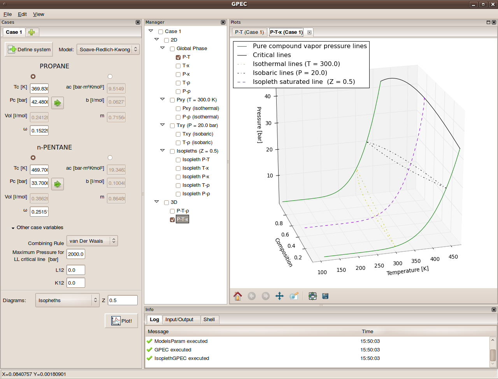

************************************************************
Proyecto Integrador de Ingeniería en Computación
************************************************************

.. image::  img/unc3-b.jpg
   :align: right
   :width: 40 % 

**Software para graficación de diagramas termodinámicos**

|
| Martín Gaitán 
| 
| FCEFyN - UNC
| 12 de mayo de 2011
|

- Director: 

   * Mg. Gustavo Wolfmann

- Codirector: 

   * Dr. Martín Cismondi Duarte
 

Introducción
************

.. class:: incremental

   - Software GPEC (2005), tesis doctoral del Dr. Cismondi
        

        Un software para la obtención de curvas
        de equilibro termodinámico de fase global para sistemas binarios, 
        que se calculan mediante ecuaciones de estado.
   

   - Situación: 

        - *Backend* (métodos númericos) (Fortran) 
        - *Frontend* (UI + graficación) (Visual Basic)
        - Comunicación mediante archivos de texto

Motivación
**********

.. class:: incremental

    - Actualmente

        - Software muy utilizado en el ambiente científico-académico

        - No se conoce otro software con prestaciones equivalentes

        - Gran utilidad en la industria: hidrocarburos, alimentación, fluídos supercríticos

    - Pero... 

        - Interfaz compleja
        - No se basa en bibliotecas
        - Lenguaje de desarrollo obsoleto
        - Sólo funciona en Windows
        - Sólo gráficos 2D

Objetivos
*********
.. class:: incremental

  - En general

    Rediseño e implementación de una nueva aplicación de
    generación de gráficos, satisfaciendo y superando las prestaciones ofrecidas 
    hasta el momento, reutilizando el backend preexistente.
        
  - En particular

    - Reimplementar el frontend sin afectar el backend
        - Implica respetar la interfaz de comunicación 
    - Gráficos: 2D y 3D, calidad, exportación, comparación, superposición
    - Multiplataforma
    - Simplificar la interfaz 
    - Mejorar la usabilidad

Breve marco Teórico 
********************

.. image:: ../images/Phase-diag_es.png
   :align: right 
   :width: 50%

- Diagrama de fase

    Gráfico utilizado para mostrar las condiciones en las que
    distintas fases termodinámicas pueden ocurrir en equilibrio.
   
.. image:: ../images/ejTipo1.png
      :align: right 
      :width: 50%
    
    
- En **Sistemas binarios**  (2 componentes)
   
    - La **composición** (y la **densidad**) se vuelven una variable => R³

Breve marco Teórico (continuación)
**********************************

- La proyección ortogonal de estas curvas tridimensionales genera gráficos 2D 

    .. image:: ../images/ejemploTx.png
       :width: 50%
       :align: right 

- También se realizan "cortes" fijando una variable (isobaras, isotermas, isopletas)

- Modelo matemático: Ecuaciones de estado que relaciones funciones de estado 

    - Todo parte de la famosa *Ecuacíón de Van der Waals*

- Distintos comportamientos segón los compuestos (todos calculables por GPEC)

Contexto de trabajo
********************

- Trabajo interdisciplinario 

    .. epigraph::

        La computación no trata sobre las computadoras más de 
        lo que la astronomía trata sobre los telescopios

        -- Edsger Dijkstra

Relevamiento de la versión preexistente
****************************************

.. figure:: ../images/visual_gpec1.png
   :width: 60%
   :align: center 

- Interfaz confusa: Demasiadas opciones simultáneas

- Gráficos: 
    - rutinas adhoc
    - rasterización de pixels. 
    - no se pueden exportar

- Diseño de base de datos (*Ms Jet*) innecesariamente complejo 

Metodología
**************
                            
- Marco conceptual: Agile Manifiesto

     - Individuos e interacciones sobre procesos y herramientas
     - Software funcionando sobre documentación extensiva
     - Colaboración con el comitente sobre negociación contractual
     - Respuesta ante el cambio sobre seguimiento (estricto) de un plan
    
- Desarrollo evolutivo

    .. image:: ../images/desarrollo_evolutivo.png
       :align: center 
       :width: 70% 

- Razones: 

  - Funcionalidades no previstas
  - Falta de conocimiento en la materia
  - Mayor rapidez
  

Tecnologías empleadas
*********************
.. class:: incremental 

   - Lenguaje: Python
     
     .. epigraph::
        :class: right
        
        El canónico *"Python es un gran primer lenguaje"* suscitó 
        *"¡Python es un gran último lenguaje!"*
 
        -- Noah Spurrier

     - Simple, potente y elegante 
     - Multiplataforma
     - Ampliamente utilizado en contextos análogos
        
   - Graficación: Matplotlib

       - Graficos de alta calidad 2D y 3D
       - Integración con toolkits gráficos
       - Exportación a multiples formatos (mapa de bits y vectoriales)
       - Desarrollo muy activo 

   - GUI: WxPython

     - Uso nativo de las APIs gráficas en cada entorno 
     - *Advanced User Interface*

Tecnologías empleadas (continuación)
************************************

.. epigraph::

    Si he visto más lejos es por haberme parado sobre hombros de gigantes
    
    Isaac Newton

- Software Libre de calidad probada como decisión técnica

- Licencias *amigables* con la comercialización

- Trabajo resultante liberado como software libre

Arquitectura
*************

- Modelo conceptual

.. image:: ../images/workflow.png
   :width: 70%
   :align: center 

Patrón de comunicación interna
*******************************
   
.. figure:: ../images/pubsub_concept.png
   :width: 50%
   :align: center 

   Patrón Publisher/Subscriber

- Aplicación modular desacoplada
- Permite la extensibilidad  
- Implementación simple

.. code-block:: python 

    # suscripción
    pub.subscribe(self.OnAppendLog, 'log')  
    # envio de un mensaje
    pub.sendMessage('log', mensaje)

API
****

.. image:: ../images/parser.png
   :width: 50%
   :align: right 

.. class:: incremental

    - Escasa documentación del formato de los archivos

      - Arduo trabajo ingeniería inversa

    - Implementada como una clase (y módulo) independiente 
        
      - Permite reutilizar el backend en otro contexto (Ejemplo: web)

    - Usa ``Wine`` sobre plataformas no Windows

      - Pero es mejorable: generar binarios nativos, *f2py*, etc. 

Gráficos
********

- Módulo independiente
- Muchas funcionalidades provistas por Matplotlib
    
    - integración con GUI
    - exportación
    - toolbox

- POO: Herencia y sobrecarga

Base de datos
*************

- Diseño muy simplificado
- Migración de datos a sqlite: 

    - soporte 

.. image:: ../image/er-database.png
   :align: center
   :width: 65%

Interfaz de usuario
*******************

- Se le prestó mucha atención
- Basada en *AUI* de wxPython
- Criterio: *"convención sobre configuración"*
- Maximización de espacio de trabajo

Verificación
*************

- Pruebas unitarias (test automáticos)

    - Principalmente sobre la API

    .. code-block:: python

        [...]
        test_write_conparin_3 (__main__.TestApiManager) ... ok
        test_write_gpecin (__main__.TestApiManager) ... ok

        ----------------------------------------------------------------------
        Ran 26 tests in 2.808s

        OK

- Usabilidad
    
    - Pruebas con usuarios
    - Análisis cuantitativo 
    

Distribución
*************

- En Windows

    - py2exe: genera un directorio *stand-alone* 
    - NSIS: genera un instalador

- En Linux

    - setuptools

Demostración
************

- ¿Murphy está en la sala?

Huevo de pascua 
****************

- De Wikipedia_ :

    (...) los huevos de pascua son mensajes, gráficos, 
    efectos de sonido o cambios inusuales en el comportamiento 
    de los programas, que se producen después de introducir 
    ciertos comandos no documentados clics con el ratón, 
    o combinaciones de teclas.

.. _Wikipedia : http://es.wikipedia.org/wiki/Huevo_de_pascua_%28virtual%29

Conclusiones
************

.. class:: incremental

    - Objetivos satisfechos: cliente conforme
    - Prestaciones de los gráficos: característica sobresaliente
    - Se mejoró la usabilidad

    - Impacto: 

        - Se utiliza para práctica en Termodinámica (UNC)
        - Presentación en RITeQ 2010 
        - Se espera continuar el desarrollo

Muchas gracias
**************

- A mi familia y a mi novia
- A mis directores
- A los demás profesores, compañeros y compañeras
- A las comunidades de Software Libre

Y especialmente... 

- Al todo el Pueblo Argentino, por la Universidad Pública que sostiene
  y debemos honrar
    
